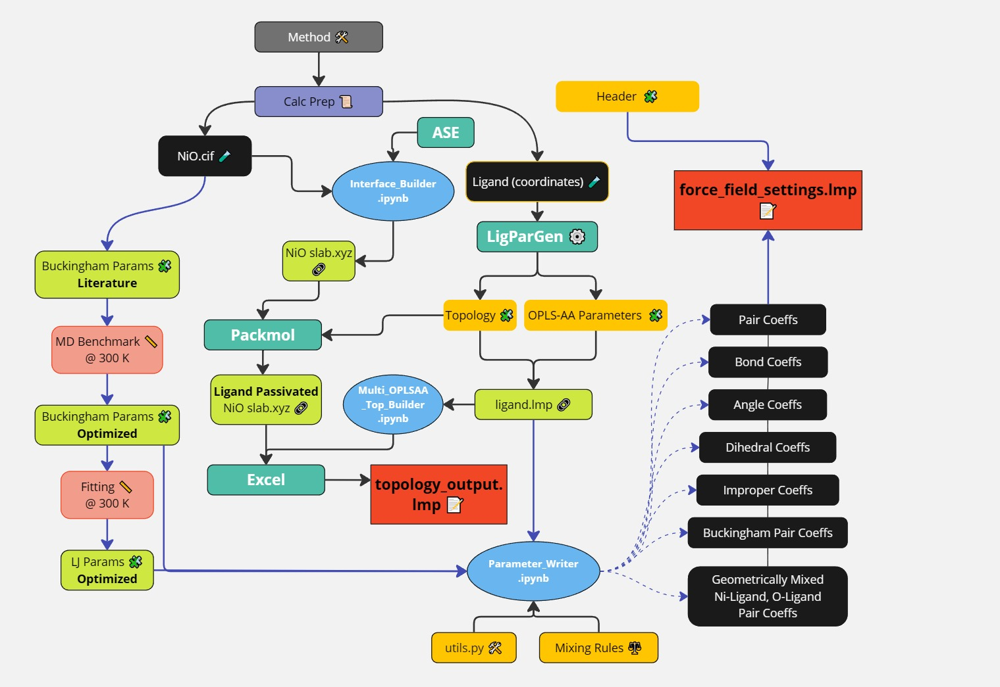

## LAMMPS simulations of a  passivated NiO corrugated surface
This code is present as-is with the goal of replicating the data presented in [doi/10.1002/aenm.202405367](https://onlinelibrary.wiley.com/doi/10.1002/aenm.202405367).  It can be modified to change the surface or the passivants used to suit the user’s task. 

For this project, the goal of the LAMMPs portion of the paper was to create a corrugated NiO-surface and passivate it with either just Me-4PACz or copassivate it with Me-4PACz and MPTMS-OH. After  applying the passivants to the surface via a moving wall potential we  ran it as a LAMMPS production run at 300K and 400K .  The features of the LAMMPs calculation are discussed more thoroughly in the draft. We will focus on file preparation here.

## Overall Workflow
The overall work process is shown in a diagram below:

## Corrugated Surface Preparation

In this module we will be focused on preparing the files to prepare the calculation. Some notes and details: 

The corrugated surface, with (011) & (011) cuts,  was prepared with Atomic Simulation Environment (ASE) tools. The passivant was added above the corrugated surface via PackMol. We didn’t attempt to use PackMol to pack the passivant tightly since there is experimental data indicating that  Me4PAcZ agglomerates. As such, we used a large vacuum above the surface and placed passivant relatively loosely. Afterwards, it was collected and applied to the surface during the LAMMPs simulation via a 12-6 LJ moving wall potential which ultimately replicated the agglomerating behavior seen in experiment.

## Forcefield Parameter Preparation
The OPLS-AA parameters and charges of the passivants  were generated with the LigParGen server:  <https://traken.chem.yale.edu/ligpargen/>  we want the .lmp format which we use as ligand.lmp

Now about the preparation of the files:

force\_field\_settings.lmp : which defines the pair, bond, angle, dihedral, improper force field coefficients.  The OPLS-AA parameters are generated as described above, note that they are LJ-style. For NiO we used OPENKim Buckingham parameters; however, the geometric mixing rule for generating mixed pair coefficients requires a 3-parameter forcefield (LJ). Thus, we had to generate our own NiO LJ parameters by fitting to experimental data & DFT calculations (110 slab, 8 layers deep). So the mixed parameters were LJ while the NiO parameters were Buckingham. Modifications to the OPLS-AA parameters also needed to be further modified in our case, the default phosphanate groups are too adhesive towards one another.  

### Header Preparation
We add this header manually:
\# Include the force field settings here

bond\_style      harmonic

angle\_style     harmonic

dihedral\_style  opls  

improper\_style  harmonic

pair\_style      lj/cut/coul/long 10.0 8.0 

kspace\_style    pppm 1e-4

kspace\_modify   slab 3.0

This is done because we need to manually modify the phosphanate groups anyways. 

## Topology and input file. 

topology\_output.lmp given the corrugated NiO.xyz file and the generated .lmp parameter file this is straightforward to generate. The masses list has to be modified afterwards since the surface atoms are not included, but they are included in the atoms list so it’s a small modification.

lammps.in prepared via the typical manner described in the manual of the program.

## Libraries Used

Atomic Simulation Environment (ASE) , along with its dependencies, and pandas.

## Conclusion

If there’s any problems or errors please report them to me @ <lgutsev@outlook.com>

Hope this code is helpful. 

