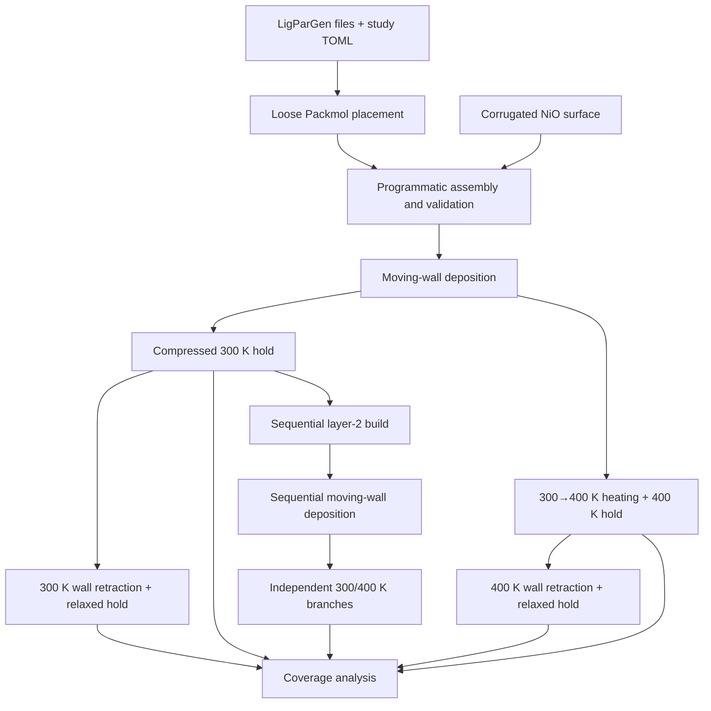

# LAMMPS simulations of passivated corrugated NiO surfaces

This repository began as a practical companion to the LAMMPS calculations
reported in
[Advanced Energy Materials, 2025, 2405367](https://onlinelibrary.wiley.com/doi/10.1002/aenm.202405367).
The original task was straightforward in concept: prepare a corrugated NiO
surface, place Me-4PACz or a Me-4PACz/MPTMS-OH mixture above it, bring those
molecules down with a moving wall, and follow the resulting film at 300 and
400 K. The same code base has also been used in
[Energy & Environmental Science, 2026, D6EE00231E](https://pubs.rsc.org/ee/article-abstract/19/6/2069/1232999/Multiphosphorylated-molecules-for-buried-interface?redirectedFrom=fulltext).

The project has since grown into a reproducible workflow for comparing pure
SAMs, simultaneously deposited CoSAMs, and sequential second-layer
depositions. It retains the physical picture and force-field choices of the
original work, but replaces the historical spreadsheet assembly with a
configuration-driven Python package, validated LAMMPS inputs, staged Slurm
launchers, and coordinate-based coverage analysis.

The repository is provided as-is so that the published calculations can be
reproduced and the surface, passivants, loading, or protocol can be adapted to
new tasks.

## Scientific picture

The corrugated NiO surface was constructed from the NiO(110) model with Atomic
Simulation Environment tools and is stored as an authoritative LAMMPS data
file. Ligands are placed relatively loosely in the vacuum above it with
Packmol. We deliberately do not ask Packmol to create an already dense
monolayer: Me-4PACz aggregates experimentally, and the simulation is intended
to let the film form dynamically rather than assume its final packing.

After a restrained relaxation, a repulsive 12-6 Lennard-Jones upper wall
moves toward the surface while the lower wall prevents atoms from leaving the
bottom of the nonperiodic cell. The wall collects the initially dispersed
ligands and creates the compressed film. The deposited state then becomes the
common starting point for independent 300 and 400 K branches.

Three related questions can therefore be separated:

- **Pure SAM:** what film does Me-4PACz form by itself?
- **CoSAM:** what happens when Me-4PACz and a secondary ligand compete for the
  surface during the same deposition?
- **Sequential deposition:** what happens when the secondary ligand is added
  only after a Me-4PACz film has already formed?

The high-dose pure Me-4PACz system controls for the possibility that an
apparent coverage improvement is caused simply by supplying more molecules.

## Workflow at a glance


```mermaid
flowchart TD
    A["LigParGen files + study TOML"] --> B["Loose Packmol placement"]
    S["Corrugated NiO surface"] --> C["Programmatic assembly and validation"]
    B --> C
    C --> D["Moving-wall deposition"]
    D --> E["Compressed 300 K hold"]
    D --> F["300→400 K heating + 400 K hold"]
    E --> K["300 K wall retraction + relaxed hold"]
    F --> L["400 K wall retraction + relaxed hold"]
    E --> G["Coverage analysis"]
    F --> G
    K --> G
    L --> G
    E --> H["Sequential layer-2 build"]
    H --> I["Sequential moving-wall deposition"]
    I --> J["Independent 300/400 K branches"]
    J --> G
```

The original workflow sketch is retained as part of the repository's
scientific history:


## Systems supplied with the repository

The base system contains 180 Me-4PACz molecules on the 21,060-atom NiO
surface. Secondary counts are derived from the stated equal-stock-volume
assumption using

```text
Nsecondary / Nprimary =
    (Csecondary / MWsecondary) / (Cprimary / MWprimary)
```

with 0.5 mg/mL Me-4PACz and 0.3 mg/mL secondary stock concentrations.
Molecular weights are calculated from the imported LigParGen mass inventory,
and the unrounded ratio and rounding decision are written to
`ratio_report.json`.

| System | Ligand inventory | Total ligands | Final atoms | Purpose |
|---|---:|---:|---:|---|
| Me-4PACz | 180 Me-4PACz | 180 | 29,160 | Experimental baseline |
| Me-4PACz/MeO-2PACz | 180 + 107 | 287 | 33,547 | CoSAM or inventory-matched sequential pair |
| Me-4PACz/MeO-4PADBC | 180 + 77 | 257 | 33,703 | CoSAM or inventory-matched sequential pair |
| Me-4PACz/DCZ-4P | 180 + 59 | 239 | 33,644 | CoSAM or inventory-matched sequential pair |
| High-dose Me-4PACz | 261 Me-4PACz | 261 | 32,805 | Mean-molecule-count loading control |

The CoSAM and corresponding completed sequential system contain exactly the
same molecular inventory. Their difference is deposition history, not total
loading. The 261-molecule control is the arithmetic mean of the three mixed
totals (239, 257, and 287); it is a molecule-count control, not an exact
anchor-count control, because DCZ-4P has two phosphonic-acid anchors.

An experimental 1:1 solution-mixing statement does not by itself establish
equal molecular counts. All production counts therefore remain explicit in
the study TOML files. A molar 1:1 alternative can be represented by setting
both ligand counts to 180 and using
`composition.basis = "molar_1_to_1"`.

## Force field

Passivant charges and bonded OPLS-AA parameters are generated independently
with the [LigParGen server](https://traken.chem.yale.edu/ligpargen/) and stored
in LAMMPS `.lmp` format. The package does not contact LigParGen, run BOSS, or
invent missing parameters.

The model preserves the hybrid treatment developed for the original work:

- ligand-ligand nonbonded interactions use Lennard-Jones plus long-range
  Coulomb terms;
- NiO self-interactions use the OPENKIM Buckingham parameters from the
  reviewed surface model;
- ligand/NiO cross interactions use pseudo-LJ Ni/O values fitted against
  experiment and DFT calculations for an eight-layer NiO(110) slab, followed
  by geometric mixing;
- phosphonate LJ terms and selected torsions are corrected because the
  unmodified LigParGen phosphonate groups are too adhesive toward one another;
- electrostatics use PPPM with slab correction.

The generated force-field header is equivalent to:

```lammps
bond_style      harmonic
angle_style     harmonic
dihedral_style  hybrid opls charmm
improper_style  cvff
pair_style      hybrid lj/cut/coul/long 10.0 8.0 buck/coul/long 10.0 8.0
pair_modify     pair lj/cut/coul/long mix geometric
kspace_style    pppm 1e-4
kspace_modify   slab 3.0
special_bonds   amber
```

Force-field coefficients remain in
`force_field_settings_lammps_with_header.lmp`. Generated state files use
`write_data ... nocoeff`, which prevents stale coefficients from being copied
into intermediate structures.

## Installation

Python 3.11 or newer and Packmol are required for building systems. LAMMPS is
required only for validation smoke tests and simulation.

```bash
python -m venv .venv
source .venv/bin/activate
python -m pip install -e .
```

Install the optional analysis dependencies when coverage analysis is needed:

```bash
python -m pip install -e '.[analysis]'
```

On QBD, the supplied launchers load the current Python and LAMMPS modules.
The build jobs use the `single` partition. Molecular-dynamics jobs use one
complete 64-core `workq` node with one MPI rank per core.

## Building a primary or CoSAM system

Each study is defined in `studies/*.toml`. The configuration records the
molecule identities and counts, deposition and hold lengths, wall policy, and
composition basis.

A single system can be prepared manually:

```bash
nio-md-prep build studies/me-4pacz-alone.toml \
    --output prepared/me-4pacz-alone

nio-md-prep validate prepared/me-4pacz-alone
```

On QBD, the primary builder prepares and validates the five primary-deposition
systems:

```bash
sbatch scripts/build_real_systems.sbatch
```

The corresponding array order is fixed across build-independent simulation
stages:

| Array index | Prepared system |
|---:|---|
| 0 | `me-4pacz-alone` |
| 1 | `me-4pacz-meo-2pacz-cosam` |
| 2 | `me-4pacz-meo-4padbc-cosam` |
| 3 | `me-4pacz-dcz-4p-cosam` |
| 4 | `me-4pacz-high-dose` |

The jobs are intentionally manual stages rather than an automatic dependency
chain. After checking that the build finished, submit deposition:

```bash
sbatch scripts/run_deposition_array.sbatch
```

After every required `deposited.data` exists, the temperature branches can be
submitted independently, including at the same time:

```bash
sbatch scripts/run_hold_array.sbatch
sbatch scripts/run_hold_400K_array.sbatch
```

The 400 K branch does not consume or modify `held-300K.data`; both branches
read the same `deposited.data`.

## Sequential second-layer deposition

Sequential preparation is not a differently labeled CoSAM. It is a genuine
two-stage experiment.

First, Me-4PACz is deposited by itself and its compressed 300 K hold is
completed. The exact
`prepared/me-4pacz-alone/held-300K.data` state becomes the substrate for all
three sequential systems. We use this compressed state rather than the later
expanded-box `equilibrated-300K.data` so that the established film is
preserved while sufficient vacuum remains above it for packing layer 2.

During stage-2 preparation:

1. every stage-1 coordinate, topology record, velocity, and box bound is
   preserved;
2. Packmol places only the secondary molecules above the existing film;
3. the completed Me-4PACz layer is fixed during a conservative
   steepest-descent/conjugate-gradient relaxation;
4. only the newly added molecules receive fresh 300 K velocities;
5. the lock is removed and the complete system evolves together during
   moving-wall deposition.

Build the three systems only after the Me-4PACz 300 K hold is available:

```bash
sbatch scripts/build_sequential_systems.sbatch
```

Sequential array indices remain identical in every later stage:

| Array index | Prepared system |
|---:|---|
| 0 | `me-4pacz-then-dcz-4p` |
| 1 | `me-4pacz-then-meo-2pacz` |
| 2 | `me-4pacz-then-meo-4padbc` |

After all three builds finish, run deposition:

```bash
sbatch scripts/run_sequential_deposition_array.sbatch
```

After all three depositions finish, launch either or both independent
temperature branches:

```bash
sbatch scripts/run_sequential_hold_array.sbatch
sbatch scripts/run_sequential_hold_400K_array.sbatch
```

No builder submits a simulation job, and no deposition job submits a hold job.
Each stage stops after its own work so that the outputs can be inspected before
the next scientific step.

### Experimental coverage-guided “lego” deposition

The optional lego-style control tests whether a secondary molecule can fill a
persistent lateral gap when it is deliberately delivered above that gap. It
does not replace the unbiased sequential calculation.

The builder reads the numerical Me-4PACz `coverage_probability.npz`, finds the
widest periodic low-occupancy channel in `x`, shifts the periodic origin so
that the channel is centered, and packs layer 2 inside it. A weak harmonic
side wall acts on **stage-2 atoms only** during the conservative minimization
and moving-wall deposition. The side wall is removed before `deposited.data`
is written; every hold and relaxation is unbiased.

The default batch submission builds only the DCZ-4P test (array index 0):

```bash
sbatch scripts/build_lego_systems.sbatch
```

Review `prepared-lego/me-4pacz-then-dcz-4p-lego/lego_plan.json`, then submit:

```bash
sbatch --array=0 \
  --export=ALL,PREPARED_ROOT=prepared-lego,SYSTEM_SUFFIX=-lego \
  scripts/run_sequential_deposition_array.sbatch
```

This is a deliberately biased geometric-control experiment. A favorable
result would show that DCZ-4P *can* occupy the gap when delivered there; it
would not demonstrate that unbiased DCZ-4P spontaneously finds the gap.
See [`docs/lego-deposition.md`](docs/lego-deposition.md) for the method,
controls, outputs, and commands for extending the test.

## Simulation stages and wall policy

Every completed build writes `deposition.in`, `hold-300K.in`,
`hold-400K.in`, `decompress-300K.in`, `decompress-400K.in`,
`equilibrate-300K.in`, and `anneal-400K.in`.

| Stage | Source | Default duration | Main output |
|---|---|---:|---|
| Moving-wall deposition | `topology_output.lmp` | 600,000 × 0.5 fs = 300 ps | `deposited.data` |
| Compressed 300 K hold | `deposited.data` | 1,000,000 × 0.5 fs = 500 ps | `held-300K.data` |
| Gradual heating | `deposited.data` | 400,000 × 0.5 fs = 200 ps | `heated-400K.data` |
| Compressed 400 K hold | heated 400 K state | 1,000,000 × 0.5 fs = 500 ps | `held-400K.data` |
| 300 K wall retraction | `held-300K.data` | 400,000 × 0.5 fs = 200 ps | `decompressed-300K.data` |
| Relaxed 300 K hold | decompressed 300 K state | 1,000,000 × 0.5 fs = 500 ps | `relaxed-300K.data` |
| 400 K wall retraction | `held-400K.data` | 400,000 × 0.5 fs = 200 ps | `decompressed-400K.data` |
| Relaxed 400 K hold | decompressed 400 K state | 1,000,000 × 0.5 fs = 500 ps | `relaxed-400K.data` |
| Optional long 300 K continuation | `held-300K.data` | 5,000,000 steps | `equilibrated-300K.data` |
| Optional long 400 K continuation | `equilibrated-300K.data` | 3,000,000 steps | `annealed-400K.data` |

Primary and CoSAM depositions use the established displacement-limited CG
relaxation. Sequential depositions use the more conservative SD/CG sequence
described above while the completed first layer is fixed. Both write
`optimized.data`, `optimized.restart`,
`optimized.lammpstrj`, and `optimization-summary.txt` before dynamics begins.

The moving upper wall ends 30 Å above the NiO reference surface:
`69.615 Å` for the supplied model. Its instantaneous location is written as
`v_zwall` in the deposition thermo output. The compressed hold stages keep the
upper wall fixed at that endpoint. Lower recoil walls use LAMMPS `EDGE`, the
current lower boundary (`-15 Å` in the supplied surface).

The optional long continuations resolve a less restrictive upper wall from
the actual preceding structure:

```text
ceil(max(120 Å, max_atom_z + 30 Å) / 10 Å) × 10 Å
```

Only the nonperiodic cell ceiling is expanded, retaining a 5 Å margin. A
numeric `production_upper_wall` in the study file overrides this automatic
policy.

### Relaxing the compressed films

The decompression branches preserve every compressed result and operate
independently at 300 and 400 K. Each branch gradually retracts the upper wall
from `69.615 Å` to the resolved production height over 200 ps, then keeps the
distant wall fixed for a 500 ps relaxed-film hold. The lower recoil wall
remains at `EDGE`, and only the periodic `x/y` dimensions are barostatted.

On QBD, first regenerate only the stage inputs for all eight prepared systems:

```bash
sbatch scripts/build_decompression_inputs.sbatch
```

This `single`-partition array does not rebuild topology and does not modify
data, restarts, trajectories, or logs. After all eight builder tasks finish,
the temperature branches can be submitted independently:

```bash
sbatch scripts/run_decompress_300K_array.sbatch
sbatch scripts/run_decompress_400K_array.sbatch
```

The common decompression array order retains the five primary indices and
appends the three sequential systems:

| Array index | Prepared system |
|---:|---|
| 0 | `me-4pacz-alone` |
| 1 | `me-4pacz-meo-2pacz-cosam` |
| 2 | `me-4pacz-meo-4padbc-cosam` |
| 3 | `me-4pacz-dcz-4p-cosam` |
| 4 | `me-4pacz-high-dose` |
| 5 | `me-4pacz-then-dcz-4p` |
| 6 | `me-4pacz-then-meo-2pacz` |
| 7 | `me-4pacz-then-meo-4padbc` |

The final trajectories are `relax-300K.lammpstrj` and
`relax-400K.lammpstrj`. The coverage batch automatically includes these
alongside the original compressed `hold-*.lammpstrj` trajectories, allowing
the wall-constrained and relaxed morphologies to be compared in the same
workbook.

## Validation and safe input refresh

`nio-md-prep` checks atom and topology counts, type remapping, charge,
coordinate bounds, molecule identities, force-field coverage, surface
provenance, wall placement, stage ordering, and—when LAMMPS is available—
zero-step executable inputs. Build provenance and hashes are recorded in
`assembly_manifest.json` and `input_hashes.json`.

Validation can be rerun as real predecessor files become available:

```bash
nio-md-prep validate prepared/SYSTEM_NAME
```

If the topology is already prepared and only the generated LAMMPS inputs need
an update, use:

```bash
nio-md-prep refresh-inputs studies/STUDY_NAME.toml \
    --output prepared/SYSTEM_NAME
```

This command regenerates stage inputs and protocol notes only. It does not run
Packmol, rebuild topology, or modify simulation data, restarts, logs, or
trajectories.

## Archiving completed and restartable runs

The generated `prepared/` trees are not stored in Git. To retain every LAMMPS
`.data` state and the small inputs needed to rerun it, create a ZIP archive:

```bash
nio-md-prep archive-runs prepared prepared-rerun prepared-rerun2 \
    --output archives/nio-md-rerun-files.zip
```

On QBD, the single-core archive launcher automatically includes every
top-level directory matching `prepared*`:

```bash
sbatch scripts/archive_prepared_runs.sbatch
```

To select roots or the output filename explicitly:

```bash
sbatch --export=ALL,\
ARCHIVE_ROOTS="prepared-rerun prepared-rerun2",\
ARCHIVE_OUTPUT=archives/cosam-reruns.zip \
scripts/archive_prepared_runs.sbatch
```

The ZIP preserves the prepared-root and system-directory layout. It contains
all `.data`, `.in`, `.lmp`, `.inp`, `.toml`, `.json`, `.txt`, and `.xyz`
files, but excludes trajectories, logs, Slurm output, restart binaries, and
analysis workbooks. `ARCHIVE_MANIFEST.json` records the repository commit and
SHA-256 checksum of every collected file. `README_RERUN.txt` gives the minimal
extraction and LAMMPS rerun instructions. Existing archives are never
overwritten unless the direct CLI is given `--force`.

## Adding another passivant

1. Generate and download the LigParGen LAMMPS file independently.
2. Run `nio-md-prep init-molecule NAME`.
3. Place the downloaded file at the displayed path as `ligpargen.lmp`.
4. Review `molecule.toml`, especially expected charge, role, and number of
   phosphonic-acid anchors.
5. Run `nio-md-prep inspect-molecule NAME`.
6. Add a study TOML with explicit molecule counts.
7. Build and validate the study.

If Packmol is unavailable during a local build, the package retains
`packmol.inp`. Run `packmol < packmol.inp`, then repeat the build with
`--packed-xyz packed.xyz`.

## Why Excel is no longer part of system preparation

The historical workflow used a spreadsheet to paste Packmol coordinates into
replicated LigParGen atom records, shift atom/molecule/topology IDs, append the
NiO surface, and repair the LAMMPS header manually. This was a data-joining
step rather than part of the scientific method.

The current assembler performs that operation programmatically:

- Packmol supplies coordinates and element order;
- LigParGen supplies charges, atom types, masses, coefficients, and bonded
  topology;
- the packaged NiO file supplies the unchanged surface;
- `nio-md-prep` verifies element order, remaps every namespace, assigns unique
  molecule IDs, and calculates counts, bounds, and total charge.

The legacy notebooks and historical examples remain in the repository as
scientific provenance and as a record of how the original calculation was
constructed. They are not required for new builds.

## Coordinate-based coverage analysis

Coverage no longer depends on coloring an OVITO image and counting pixels.
The analysis module reads the actual LAMMPS coordinates and assembly manifest,
projects ligand van der Waals footprints into the periodic surface plane, and
reports total, uncovered, component-resolved, and overlapping coverage with
block-based uncertainty.

Analyze one trajectory with:

```bash
nio-md-prep analyze-coverage prepared/me-4pacz-alone \
    --trajectory hold-300K.lammpstrj \
    --last-frames 100 \
    --timestep-fs 0.5
```

On QBD, the batch launcher finds every available `hold-300K.lammpstrj` and
`hold-400K.lammpstrj`, analyzes them on the `single` partition, and builds one
consolidated workbook:

```bash
sbatch scripts/analyze_coverage_holds.sbatch
```

The final workbook is written to:

```text
prepared/coverage_summary.xlsx
```

Run this job before the interfacial batch when rebuilding the complete draft
tables, because the compact publication workbook joins both analyses.

See [`docs/coverage-analysis.md`](docs/coverage-analysis.md) for the numerical
method, output columns, convergence controls, and per-study files.

## Anchor-resolved interfacial structure analysis

Projected coverage deliberately reproduces the historical top-view shielding
metric, but it cannot distinguish an NiO-bound phosphonate from a molecule
lying above another SAM. A separate interfacial module therefore reports:

- exposed-Ni site ownership by primary and secondary components;
- molecule and phosphonate-terminal anchoring populations;
- a fixed 3.25 Å contact definition with 3.0/3.25/3.5 Å sensitivity;
- persistent contacts and residence episodes;
- bound/unbound heights, molecular-plane orientation, multi-anchor geometry,
  conventional molecular tilt, and orientational `P2`;
- component-resolved local-height density profiles;
- lateral same-component and cross-component two-dimensional RDFs; and
- matched compressed-hold versus decompressed-relaxation changes.

Analyze one trajectory:

```bash
nio-md-prep analyze-interface prepared/me-4pacz-then-dcz-4p \
    --trajectory hold-300K.lammpstrj \
    --last-frames 100 \
    --timestep-fs 0.5
```

Analyze every available compressed and relaxed 300/400 K trajectory on the
`single` partition and create the separate consolidated workbook:

```bash
sbatch scripts/analyze_interface_holds.sbatch
```

The workbook is written to:

```text
prepared/interface_structure_summary.xlsx
prepared/publication_summary.xlsx
```

For DCZ-4P, its `Terminal States` sheet directly reports zero-, one-, and
two-terminal anchoring populations. The `Hold vs Relax` sheet makes it
possible to identify structures maintained only by the compressed upper wall.
The separate `publication_summary.xlsx` contains a compact `Draft Summary`
sheet with copy-ready mean ± block-SEM fields, a matched
`CoSAM vs Sequential` sheet whose deltas are always sequential minus CoSAM,
and an `All Metrics` audit sheet. It is intended for copying into a
preliminary manuscript while the detailed workbooks remain the full audit
trail.
All systems use the same 600 canonical exposed-Ni atom identities mapped from
the authoritative pristine corrugated surface, including sequential systems
whose NiO coordinates have already evolved during stage 1.

The existing builders and runners can also write an independent replicate
tree. Set `PREPARED_ROOT` on every stage and provide new random seeds only to
the two build stages. For example, seed 02 uses:

```bash
sbatch --export=ALL,PREPARED_ROOT=prepared/replicates/seed-02,PACKMOL_SEED=202607242,VELOCITY_SEED=31415927 scripts/build_real_systems.sbatch
sbatch --export=ALL,PREPARED_ROOT=prepared/replicates/seed-02 scripts/run_deposition_array.sbatch
sbatch --export=ALL,PREPARED_ROOT=prepared/replicates/seed-02 scripts/run_hold_array.sbatch
sbatch --export=ALL,PREPARED_ROOT=prepared/replicates/seed-02 scripts/run_hold_400K_array.sbatch

sbatch --export=ALL,PREPARED_ROOT=prepared/replicates/seed-02,PACKMOL_SEED=202608242,VELOCITY_SEED=31416927 scripts/build_sequential_systems.sbatch
sbatch --export=ALL,PREPARED_ROOT=prepared/replicates/seed-02 scripts/run_sequential_deposition_array.sbatch
sbatch --export=ALL,PREPARED_ROOT=prepared/replicates/seed-02 scripts/run_sequential_hold_array.sbatch
sbatch --export=ALL,PREPARED_ROOT=prepared/replicates/seed-02 scripts/run_sequential_hold_400K_array.sbatch
```

The 300 and 400 K hold arrays are independent branches from each replicate's
`deposited.data` and may be submitted concurrently after deposition finishes.

See [`docs/interfacial-analysis.md`](docs/interfacial-analysis.md) for the
definitions, cutoff policy, seed-03 values, output sheets, and interpretation
limits.

## Repository map

| Path | Contents |
|---|---|
| `inputs/molecules/` | Reviewed LigParGen files and molecule manifests |
| `inputs/surfaces/` | Authoritative corrugated NiO surface |
| `studies/` | Explicit study compositions and protocols |
| `src/nio_md_prep/` | Assembly, validation, input generation, and analysis code |
| `scripts/` | QBD build, simulation, and analysis launchers |
| `prepared/` | Generated systems and simulation results; not source data |
| `examples/` | Historical calculations retained for provenance |

## Contact

Problems, corrections, and useful extensions are welcome at
<lgutsev@outlook.com>.

I hope this code is helpful.
