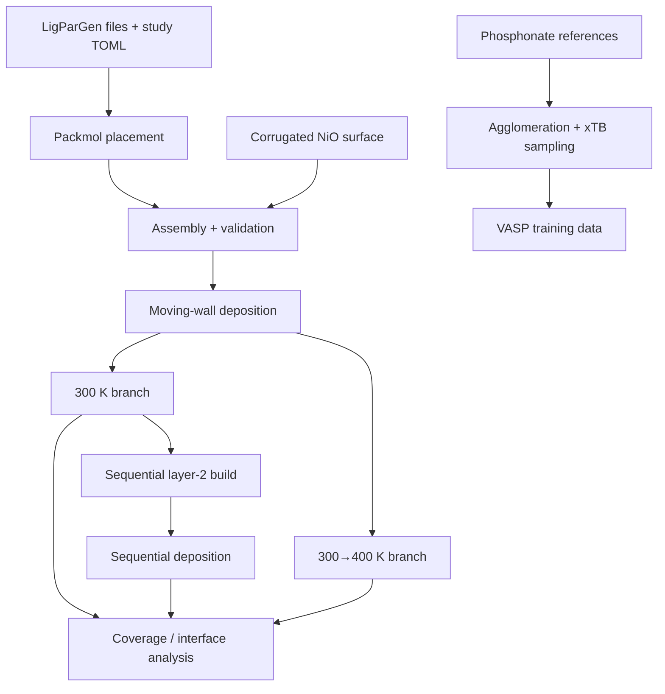
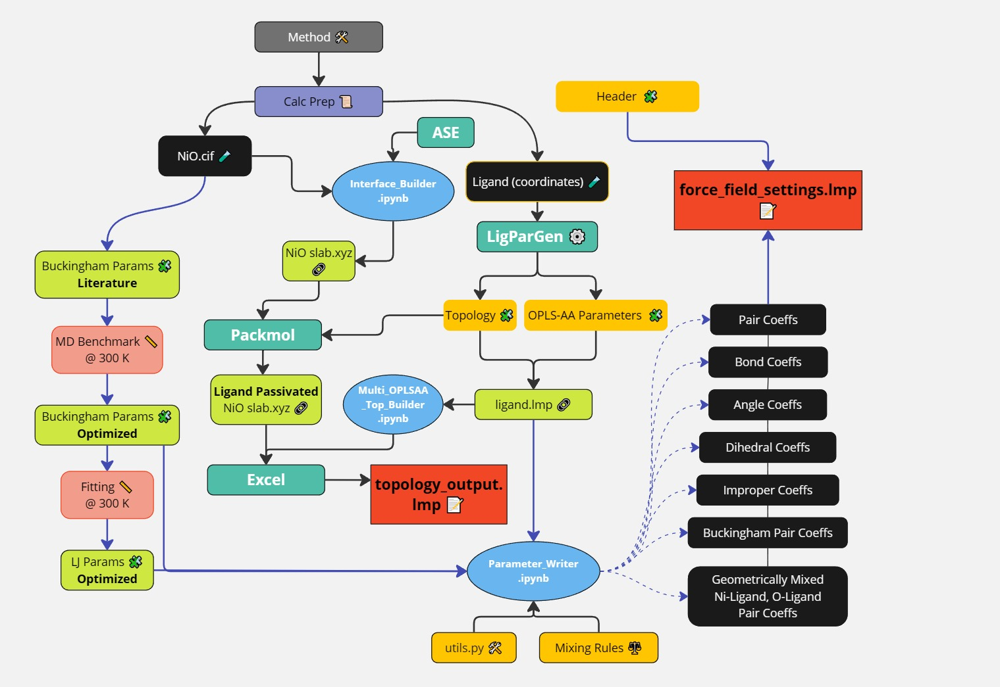

# NiO MD Passivation

Reproducible molecular-dynamics workflows for phosphonate self-assembled layers on corrugated NiO surfaces.

This repository began as a practical companion to the LAMMPS calculations reported in [Advanced Energy Materials, 2025, 2405367](https://onlinelibrary.wiley.com/doi/10.1002/aenm.202405367) and has also been used in [Energy & Environmental Science, 2026, D6EE00231E](https://pubs.rsc.org/ee/article-abstract/19/6/2069/1232999/Multiphosphorylated-molecules-for-buried-interface?redirectedFrom=fulltext).

It has since grown into a configuration-driven workflow for building, running, validating, and analyzing pure SAM, CoSAM, and sequential-deposition models. The same code base also contains phosphonate-agglomeration tooling for generating xTB/VASP training data for future MLIP work.

The root README is intentionally an overview. Detailed methods, production commands, analysis definitions, controls, and training-data workflows live in [`docs/`](docs/README.md).

## What the repository provides

- reproducible assembly of corrugated NiO + phosphonate systems from reviewed LigParGen inputs;
- pure Me-4PACz, mixed CoSAM, high-dose controls, and true two-stage sequential deposition;
- staged LAMMPS protocols with moving-wall deposition, independent 300/400 K branches, wall retraction, and relaxed holds;
- coordinate-based coverage and void-topology analysis;
- anchor-resolved interfacial structure analysis with force-field-aware reporting policies;
- experimental LEGO/LEGO2 accessibility controls that deliberately seed secondary molecules into persistent gaps;
- campaign inventory, validation, safe input regeneration, and run archiving;
- reproducible phosphonate agglomeration generation with xTB sampling and VASP training-set preparation, including mixed agglomerates.

## Scientific scope

The classical workflow asks three related questions while keeping molecular inventories explicit:

1. **Pure SAM:** what film does Me-4PACz form by itself?
2. **CoSAM:** what happens when Me-4PACz and a secondary ligand compete during the same deposition?
3. **Sequential deposition:** what changes when the secondary ligand is introduced only after an Me-4PACz layer has already formed?

A high-dose pure Me-4PACz system is retained as a loading control. The CoSAM and corresponding sequential system use the same molecular inventory, so their comparison isolates assembly history rather than total loading.

The classical model deliberately preserves the physical picture and force-field treatment of the original work. It is useful for packing, coverage, morphology, and comparative structural observables, but it should not be interpreted as a reactive or electronic-structure model. See [`docs/project-design.md`](docs/project-design.md) and [`docs/interfacial-analysis.md`](docs/interfacial-analysis.md) for the modeling assumptions and interpretation limits.

## Workflow at a glance


```mermaid
flowchart TD
    A["LigParGen files + study TOML"] --> B["Packmol placement"]
    S["Corrugated NiO surface"] --> C["Assembly + validation"]
    B --> C
    C --> D["Moving-wall deposition"]
    D --> E["300 K branch"]
    D --> F["300→400 K branch"]
    E --> G["Coverage / interface analysis"]
    F --> G
    E --> H["Sequential layer-2 build"]
    H --> I["Sequential deposition"]
    I --> G
    J["Phosphonate references"] --> K["Agglomeration + xTB sampling"]
    K --> L["VASP training data"]
```

The original workflow sketch is retained for scientific provenance:



## Quick start

Python 3.11 or newer and Packmol are required for system construction. LAMMPS is required for simulation and executable validation.

```bash
python -m venv .venv
source .venv/bin/activate
python -m pip install -e .
```

Optional analysis and test dependencies:

```bash
python -m pip install -e '.[analysis]'
python -m pip install -e '.[test]'
pytest
```

Build and validate one study:

```bash
nio-md-prep build studies/me-4pacz-alone.toml \
    --output prepared/me-4pacz-alone
nio-md-prep validate prepared/me-4pacz-alone
```

For the staged QBD production workflow, sequential deposition, decompression controls, and launcher conventions, use [`docs/classical-md-workflow.md`](docs/classical-md-workflow.md).

## Documentation

Start with the [documentation index](docs/README.md).

| Topic | Document |
|---|---|
| Scientific model, supplied systems, force field | [`docs/project-design.md`](docs/project-design.md) |
| Classical build/run workflow and controls | [`docs/classical-md-workflow.md`](docs/classical-md-workflow.md) |
| Validation, inventory, archiving, maintenance | [`docs/operations.md`](docs/operations.md) |
| Coordinate-based SAM coverage | [`docs/coverage-analysis.md`](docs/coverage-analysis.md) |
| Anchor-resolved interfacial analysis | [`docs/interfacial-analysis.md`](docs/interfacial-analysis.md) |
| Coverage-guided LEGO control | [`docs/lego-deposition.md`](docs/lego-deposition.md) |
| Localized 2D-void LEGO2 control | [`docs/lego2-deposition.md`](docs/lego2-deposition.md) |
| Agglomeration/xTB/VASP training-data workflow | [`docs/agglomeration-training.md`](docs/agglomeration-training.md) |

## Repository map

| Path | Contents |
|---|---|
| `inputs/molecules/` | Reviewed LigParGen files and molecule manifests |
| `inputs/surfaces/` | Authoritative corrugated NiO surface |
| `studies/` | Explicit study compositions and protocols |
| `src/nio_md_prep/` | Assembly, validation, input generation, and analysis code |
| `scripts/` | QBD build, simulation, analysis, and campaign launchers |
| `docs/` | User and scientific documentation |
| `prepared/` | Generated systems and simulation results; not source data |
| `examples/` | Historical calculations retained for provenance |

## Reproducibility and provenance

The historical spreadsheet/notebook workflow remains in the repository as provenance, but new production systems should be generated through `nio-md-prep`. Generated prepared trees are intentionally not versioned; manifests, hashes, validators, inventories, and archive helpers are provided so that production calculations can still be audited and reproduced.

The repository is provided as-is so that the published calculations can be reproduced and the surface, passivants, loading, or protocol can be adapted to new tasks.

## Contact

Problems, corrections, and useful extensions are welcome at <lgutsev@outlook.com>.
