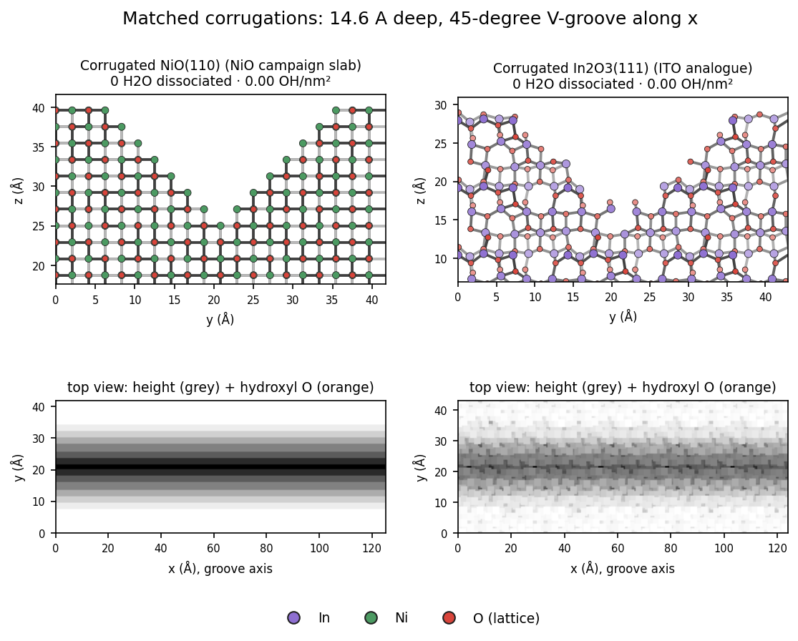
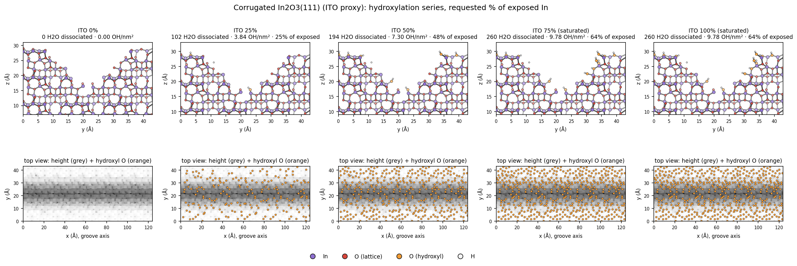
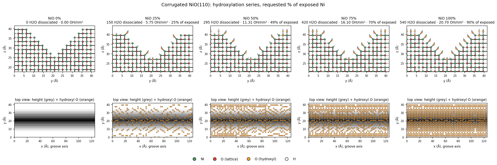
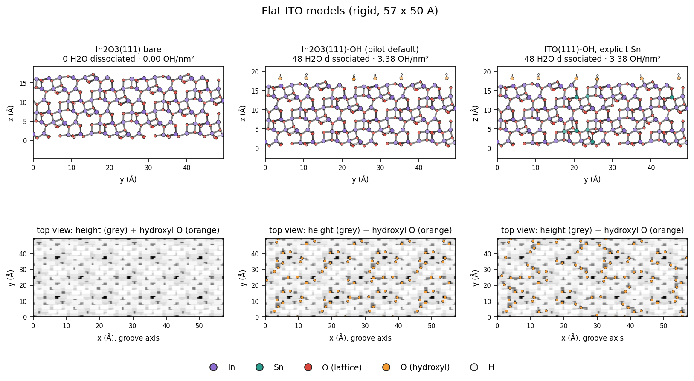
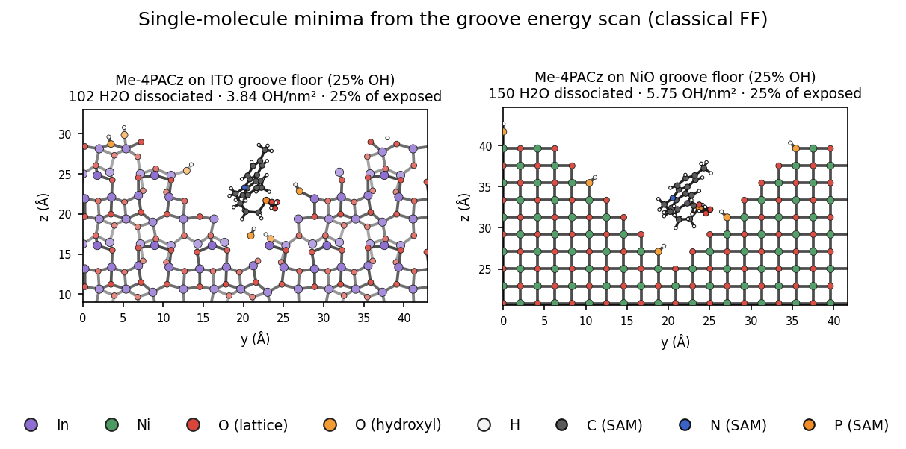

# Surface model gallery

All pictures are generated with `scripts/ito/render_surfaces.py` from the committed slab files, so they can be regenerated exactly (commands at the end). Each cross-section is a thin slice along the groove axis x, shown as a y–z view with bonds drawn. Metal–O bonds under 2.6 Å and O–H bonds under 1.15 Å are shown. Atoms farther from the viewer are drawn paler. Top views show the surface height in grey, with hydroxyl O in orange.

## NiO and ITO corrugations side by side



- **Left:** the authoritative corrugated NiO(110) slab used by the NiO campaign (`inputs/surfaces/corrugated-nio-110`, drawn from its unchanged rigid copy `corrugated-nio-110-rigid-oh000`). Seven 2.085 Å monatomic steps give a 14.6 Å deep, 45° V-groove along x.
- **Right:** the ITO analogue, `in2o3-111-groove-oh000`. Five neutral O–In–O trilayer steps of 2.92 Å reproduce the same 14.6 Å depth and 45° walls in a 123.9 × 42.9 Å cell (NiO: 125.1 × 41.7 Å).

Construction and caveats: [`docs/ito/ito-model.md`](ito/ito-model.md) §3b.

## Hydroxylation series





Coverage levels are 0 / 25 / 50 / 75 / 100 % of the exposed-cation inventory, using the InterfaceForge NiO-MLIP convention (dissociated water, scattered).
- **ITO saturates at 64 %** without OH overlap, so its 75 % and 100 % panels are the same surface.
- **NiO reaches 90 %.**
- **Experiments point to the low end:** about 0–25 % for NiO, about 25 % for ITO. See `ito-model.md` §3c.
- **The NiO variants are rigid slabs** for the ITO-extension pipeline, not the flexible Buckingham production model.

## Flat ITO models



The flat models are bare In2O3(111), hydroxylated In2O3(111) (the default for the flat pilots), and explicit Sn-doped ITO (2 Sn_In + O_i clusters, 9.2 % Sn). All are stoichiometric, neutral and dipole-free by construction. See `docs/ito/ito-model.md` §2–4.

## A SAM molecule in the groove



These are the lowest-energy groove-floor placements of one Me-4PACz from the single-molecule scans:
- ITO, 25 % OH: E_int −87 kcal/mol
- rigid NiO, 25 % OH: E_int −128 kcal/mol

Both are classical-FF physisorption minima. The molecule sits inside the groove between the walls. Only a thin slab slice is drawn, so the wall atoms it touches in front of and behind the slice are not all visible. Poses are in `docs/ito/data/poses/`; numbers and caveats are in `docs/ito/adsorption-scan.md`.

## Regenerating

```bash
R=scripts/ito/render_surfaces.py
python $R images/surfaces/nio_ito_groove_comparison.png inputs/surfaces/corrugated-nio-110-rigid-oh000 inputs/ito/surfaces/in2o3-111-groove-oh000
python $R images/surfaces/ito_hydroxylation_series.png inputs/ito/surfaces/in2o3-111-groove-oh{000,025,050,075,100}
python $R images/surfaces/nio_hydroxylation_series.png inputs/surfaces/corrugated-nio-110-rigid-oh{000,025,050,075,100}
python $R images/surfaces/ito_flat_models.png inputs/ito/surfaces/{in2o3-111-bare,in2o3-111-oh,ito-111-oh}
python $R images/surfaces/me-4pacz_in_groove.png inputs/ito/surfaces/in2o3-111-groove-oh025 inputs/surfaces/corrugated-nio-110-rigid-oh025 \
    --molecules docs/ito/data/poses/me-4pacz_ito-groove-oh025_floor.xyz docs/ito/data/poses/me-4pacz_nio-groove-oh025_floor.xyz --no-top-view
```

Add `--labels ...` and `--title ...` for the captions used above.
